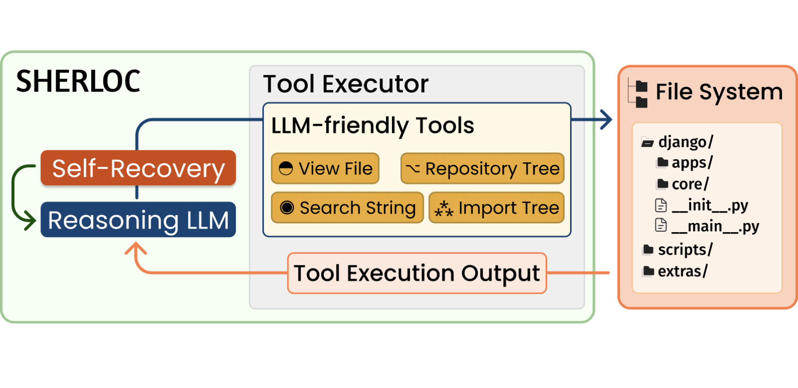

<!--- BADGES: START --->

[](https://2026.emnlp.org/)
[](https://arxiv.org/abs/2606.24820)
[](https://opensource.org/licenses/Apache-2.0)
[](https://www.python.org/)

<!--- BADGES: END --->

# SHERLOC: Structured Diagnostic Localization for Code Repair Agents

SHERLOC is a training-free framework that finds *where* a bug lives in a repository and explains
*why*, so a downstream repair agent can start from a short list of file paths and line ranges
instead of the whole codebase. It never edits code and never proposes a patch.

This recipe contains the code for the SHERLOC method, as presented in the paper
[SHERLOC: Structured Diagnostic Localization for Code Repair Agents](https://arxiv.org/abs/2606.24820).

## More About SHERLOC

<div>
LLM agents solve repository-level coding tasks through multi-turn tool use, but utilize half their
budget on locating faults before editing. Dedicated localization frameworks have emerged, yet are
still evaluated as file retrieval rather than actionable diagnosis, producing locations without the
diagnostic context a repair agent needs. We introduce SHERLOC (<em>Structured Hypothesis-driven
Exploration and Reasoning for Localization</em>), a training-free framework pairing a reasoning LLM
with compact repository tools and self-recovery, without fine-tuning or multi-agent orchestration.
SHERLOC reaches state-of-the-art localization across model scales: 84.33% accuracy@1 on SWE-Bench
Lite and 81.27% recall@1 on SWE-Bench Verified; at ~30B parameters, it matches or outperforms other
agentic methods. Injecting our locations and diagnostic findings into repair agents yields, on
average, +5.95 pp resolve rate on SWE-Bench Verified while cutting localization and total tokens
by 36.7% and 23.1%.
</div>

<p align="center">
  
</p>

This recipe is self-contained under `recipes/sherloc/`: the exploration loop, repository tools,
prompts, and optional SWE-bench scoring. It adds no code to `nemo_skills/`.

## What is here

```text
recipes/sherloc/
├── inference/sherloc.py                    SherlocGenerationTask: the exploration loop
├── inference/sherloc_utils/                repository view, tools, dialogue, context, patches
├── prompt/eval/sherloc/system.yaml         the localization prompt
├── dataset/swe-bench-{lite,verified}/      optional SWE-bench prepare scripts
├── evaluation/sherloc.py                   scores predicted locations against the gold patch
├── metrics/sherloc.py                      SherlocMetrics: Accuracy@1, Recall@1, chunk coverage
└── tests/                                  unit tests for the evaluator, metrics and parser
```

The next section is the intended entry point: run SHERLOC on a repository snapshot.
SWE-bench scoring is optional and is covered after that.

## Running it on your own repository

SHERLOC reads a repository from a pickled snapshot rather than a live checkout, which keeps a run
hermetic and stops the agent touching your working tree.

### 1. Build a repository snapshot

A pickle of a dict with a `structure` key. Directories map to sub-dictionaries; each file maps to a
record with **exactly** the keys `classes`, `functions` and `text` (the file's lines). The exact key
set matters, since `RepoManager` tells a file from a directory by testing for it. `classes` and
`functions` may be left empty. Save the result as `<instance_id>.pkl` inside the directory you pass
as `++mount_directory`.

```python
import pickle
from pathlib import Path

REPO, INSTANCE_ID, OUT_DIR = Path("/path/to/checkout"), "myproject-001", Path("/path/to/repos")

def build(root):
    structure = {}
    for path in sorted(root.rglob("*")):
        if path.is_dir() or ".git" in path.parts:
            continue
        rel = path.relative_to(root)
        node = structure
        for part in rel.parts[:-1]:
            node = node.setdefault(part, {})
        try:
            text = path.read_text(encoding="utf-8").splitlines()
        except (UnicodeDecodeError, OSError):
            continue
        node[rel.parts[-1]] = {"classes": [], "functions": [], "text": text}
    return {"instance_id": INSTANCE_ID, "structure": structure}

OUT_DIR.mkdir(parents=True, exist_ok=True)
snapshot = build(REPO)
with open(OUT_DIR / f"{INSTANCE_ID}.pkl", "wb") as f:
    pickle.dump(snapshot, f)
```

### 2. Write the input file

One JSON object per line. `instance_id` must match the snapshot file name, and `problem_statement`
is the bug report shown to the model.

```jsonl
{"instance_id": "myproject-001", "problem_statement": "Cache keys collide across locales..."}
```

### 3. Run SHERLOC

Directly, against any OpenAI-compatible endpoint:

```bash
python -m recipes.sherloc.inference.sherloc \
    ++input_file=/path/to/issues.jsonl \
    ++output_file=/path/to/output/sherloc.jsonl \
    ++prompt_config=recipes/sherloc/prompt/eval/sherloc/system.yaml \
    ++mount_directory=/path/to/repos \
    ++server.server_type=vllm \
    ++server.base_url=http://localhost:5000/v1 \
    ++server.model=<model-served-by-your-endpoint> \
    ++tokenizer=<huggingface-tokenizer-id> \
    ++total_steps=20 \
    ++max_seq_length=262144
```

Or through the NeMo-Skills pipeline, which adds job orchestration and optional model hosting and
needs a [cluster config](../../docs/basics/cluster-configs.md):

```bash
ns generate \
    --cluster=local \
    --generation_module=recipes.sherloc.inference.sherloc \
    --server_type=vllm \
    --model=<model-name-or-path> \
    --server_gpus=1 \
    --input_file=/workspace/issues.jsonl \
    --output_dir=/workspace/sherloc-run \
    ++prompt_config=recipes/sherloc/prompt/eval/sherloc/system.yaml \
    ++mount_directory=/repos
```

`inference.endpoint_type` defaults to `text`, so the prompt is rendered with the tokenizer's chat
template and a tokenizer must be resolvable — set `++tokenizer` if your model name is not a Hugging
Face id, or switch to `++inference.endpoint_type=chat`. `tokens_to_generate` defaults to `81920` and
`max_seq_length` to `262144`; lower both to match your endpoint.

### 4. Read the output

Each output line is the input record plus:

| Field | Meaning |
| --- | --- |
| `locations` | The answer: `{file_path, start_line, end_line, raw}` entries |
| `findings` | The `<findings>` diagnosis as a string, or `null` if the model omitted that block |
| `turns` | Full transcript: tool calls, tool outputs, per-turn token counts |
| `status` | `success`, `failed` or `skipped` |
| `reason` | Why a run ended early, e.g. `context_length_exceeded`, `max_steps_exceeded` |

The model answers with a `<findings>` block (free-form diagnosis) followed by a `<locations>` block:

```text
<findings>
- Root cause: make_key() omits the active locale, so entries written under one
  locale are served under another.
</findings>

<locations>
src/mypkg/cache.py:L112-L138
src/mypkg/locale.py:L44
</locations>
```

`<locations>` is parsed into structured fields and `<findings>` is stored as the block text.
Both `path:L<start>-L<end>` and single `path:L<line>` forms are accepted; a line matching
neither is preserved verbatim under `raw`. If the model omits `<findings>`, that field is `null`.

## Scoring on SWE-bench (optional)

The `dataset/`, `evaluation/` and `metrics/` directories score SHERLOC locations against the
gold SWE-bench patch. They are not a built-in Nemo-Skills benchmark; pass the dataset directory
as the `--benchmarks` path:

```bash
ns prepare_data recipes/sherloc/dataset/swe-bench-lite recipes/sherloc/dataset/swe-bench-verified

ns eval \
    --cluster=local \
    --benchmarks=recipes/sherloc/dataset/swe-bench-verified \
    --server_type=vllm \
    --model=<model-name-or-path> \
    --server_gpus=8 \
    --output_dir=/workspace/sherloc-run
```

Evaluation additionally needs per-instance repository snapshots named `<instance_id>.pkl` under
`++mount_directory` (default `/repos/`), built at each instance's base commit. Those are not
distributed here, so this recipe does not by itself reproduce the paper's tables end to
end.

## Choosing a model

SHERLOC inherits the NeMo-Skills model layer, so the backbone is pure configuration:
`++server.server_type` accepts `vllm`, `sglang`, `trtllm`, `megatron`, `openai`, `azureopenai` and
`gemini`; point at an endpoint with `++server.base_url` (or `++server.host`/`++server.port`) and
authenticate with `++server.api_key` or `++server.api_key_env_var`. Self-hosted servers need no key.

Two model properties matter in practice: the **context window**, since the first turn holds the whole
filtered repository tree (set `++max_seq_length` to what your endpoint really serves), and **reasoning
output** (`++remove_thinking=True` strips the reasoning span from replies so earlier chains of thought
stop consuming context).

## Limitations

- **Python only.** The default file extensions are `py` and `cfg`, and the import graph behind
  `connected_tree` parses Python imports.
- **Evaluated on SWE-Bench-style repositories** — mature open-source Python projects with a written
  issue. Transfer to private codebases or other issue styles is untested.
- **Snapshot input.** SHERLOC observes no build system, no test run, no runtime trace and no version
  control history.
- **Aggressive default filtering.** `exclude_dirs` drops test, documentation and data directories, so
  a fix living in one of them is unreachable.
- **Localization only.** SHERLOC produces locations and a rationale, not a patch.

## Tests

```bash
pytest recipes/sherloc/tests/
```

## Cite

Please use the following citation:

```bibtex
@inproceedings{tamoyan-etal-2026-sherloc,
    title = "{SHERLOC}: Structured Diagnostic Localization for Code Repair Agents",
    author = "Tamoyan, Hovhannes  and
      Narenthiran, Sean  and
      Arakelyan, Erik  and
      Mezini, Mira  and
      Ginsburg, Boris",
    booktitle = "Proceedings of the 2026 Conference on Empirical Methods in Natural Language Processing (EMNLP)",
    year = "2026",
    publisher = "Association for Computational Linguistics",
    url = "https://arxiv.org/abs/2606.24820",
}
```

## Links

[NeMo-Skills](https://github.com/NVIDIA-NeMo/Skills) | [SWE-Bench](https://www.swebench.com/) | [arXiv](https://arxiv.org/abs/2606.24820)

## Disclaimer

> This repository contains experimental software and is published for the sole purpose of giving additional background details on the respective publication.
